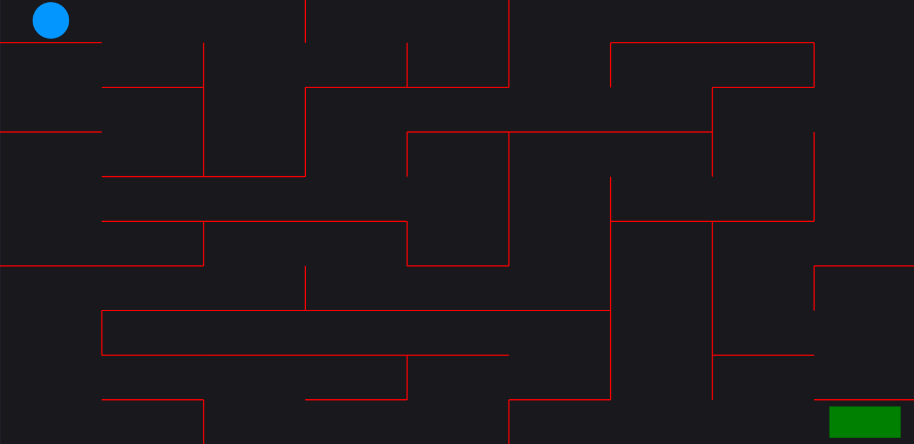

<!-- PROJECT LOGO -->
 

  <h3 align="center">Maze Game</h3>

  

    A simple and clean maze generator and game
   
<!-- ABOUT THE PROJECT -->
## About The Project

This project creates a maze and allows the player to control a ball with WASD or the Arrow keys to try to reach the goal. The project was created with the express purpose of focusing on data structures and recursion.

### Built With

This section should list any major frameworks that you built your project using. Leave any add-ons/plugins for the acknowledgements section. Here are a few examples.
* [Javascript]
* [HTML]
* [Matter.js]

